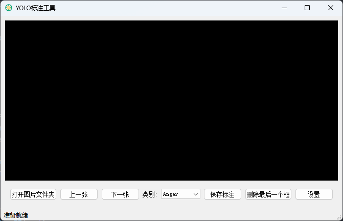
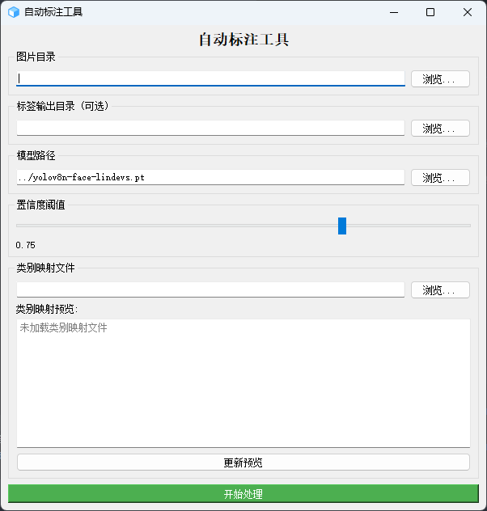
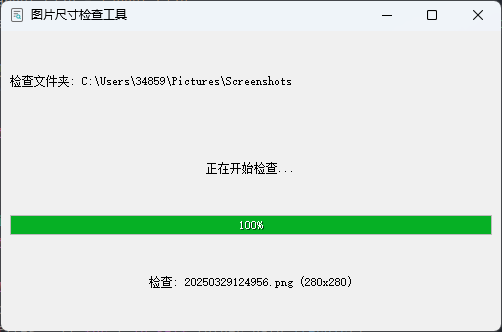
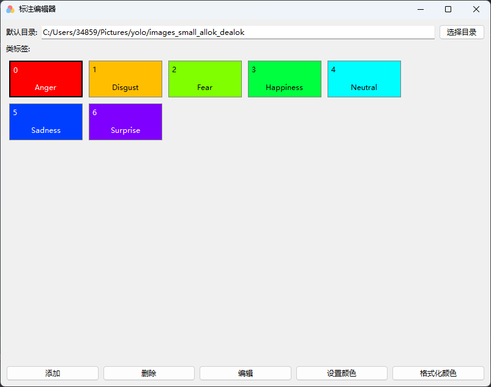
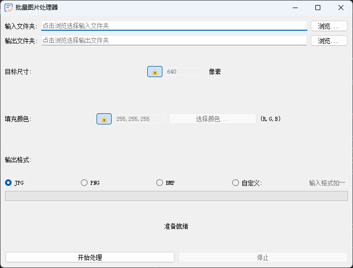
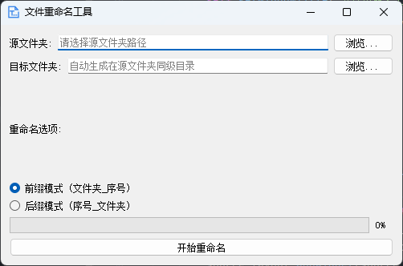
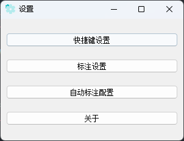
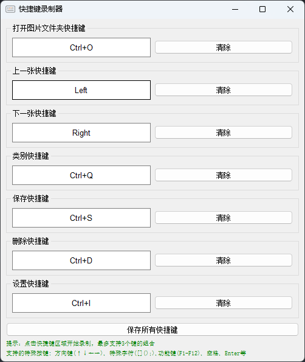
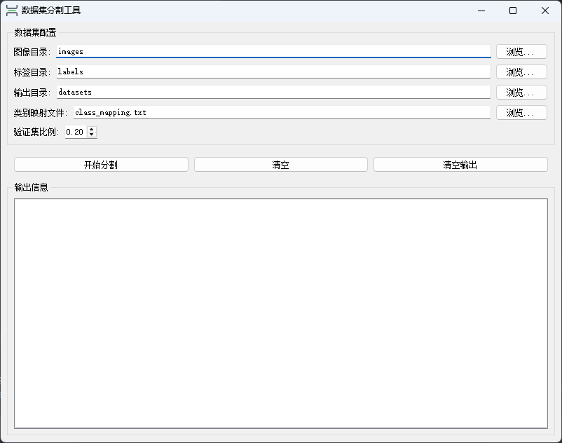

# LabelingProgram
简易YOLO标注工具

## 概述
本文档展示了情感数据集标注工具的各项界面功能。该工具为YOLO格式的情感检测数据集提供全流程管理方案。

## 主界面
  
*主控制面板提供标注所有功能的快速访问入口*

---

## 自动标注界面（需要显卡，并配置python环境）
  
*自动检测人脸并生成带分类标签的YOLO格式标注文件*

---

## 文件夹检查
  
*验证数据集图片大小是否符合*

---

## 配置面板
  
*设置类别映射、默认图片路径应用程序配置*

---

## 数据处理
  
*原始图像处理与训练数据准备*

---

## 文件重命名
  
*按照命名规范批量重命名文件*

---

## 应用设置
  
*自定义应用程序偏好设置*

---

## 快捷键说明
  
*提升标注工作效率的键盘快捷键*

---

## 数据集分割器
  
*按可配置比例将数据集划分为训练集和验证集*

## 使用指南
1. 首先通过**配置面板**设置类别映射关系
2. 使用**自动标注**功能处理原始图像
3. 通过**文件夹检查**验证数据结构
4. 使用**数据集分割器**划分训练/验证集
5. 在**应用设置**中个性化工具配置

